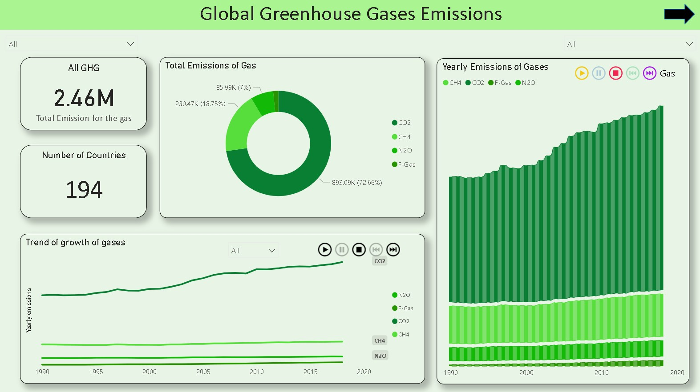
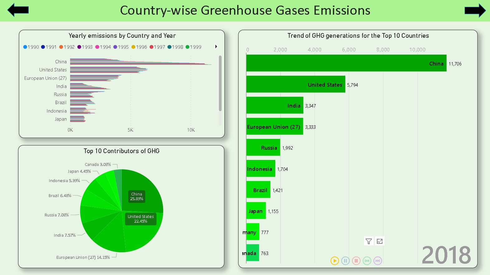
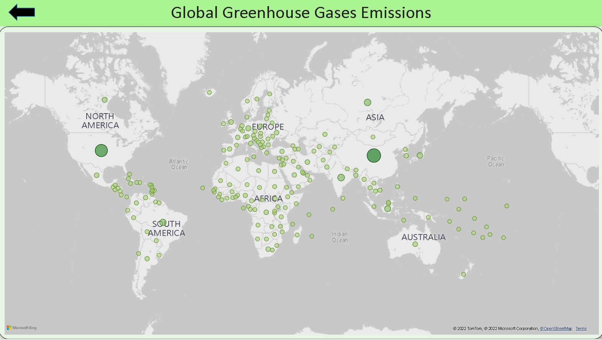

# Global-Greenhouse-Emissions
Power BI dashboard to test the hypothesis 'Developing Nations emit more greenhouse gases than the developed nations'.

Dashboard's features are : 

•	Built an interactive dashboard in Power BI to test the hypothesis that developing nations emit more greenhouse gases.

• Analyzed yearly emissions of countries and showed the trend of increase of emissions year on year.

• Used heat map to highlight countries with highest emissions. 

 
•  Performed data cleaning and standardization using PowerQuery and Microsoft Excel.  

The following are the snippets of the dashboard in PowerBI :
  
  

  

